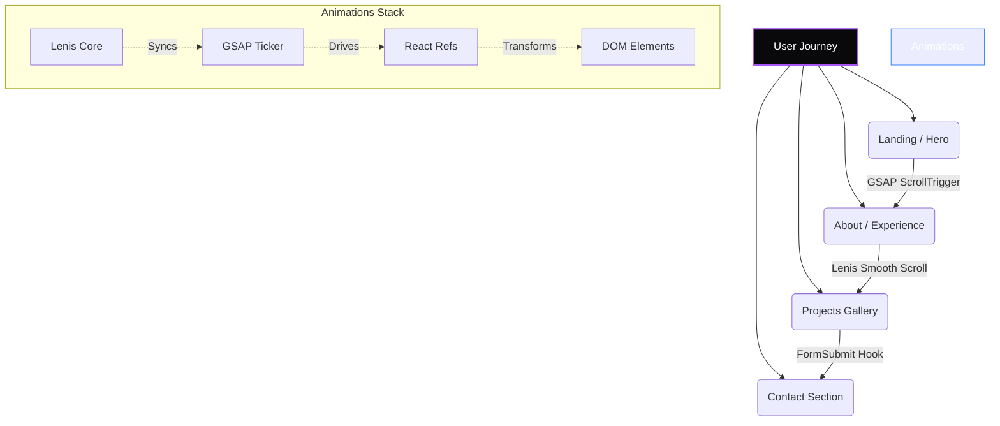

<div align="center">
  

  <a href="https://git.io/typing-svg">
    
  </a>

  <h3>A highly interactive, award-winning-style portfolio.</h3>

  <p>
    Built with <strong>Next.js 14</strong>, <strong>React</strong>, <strong>GSAP</strong>, and <strong>Tailwind CSS</strong> to showcase projects, skills, and AI expertise through a premium, 60fps cinematic web experience.
  </p>

  <div>
    
    
    
    
  </div>
</div>

<br/>

## ✨ Key Features

- **Cinematic Animations**: Implements Awwwards-level GSAP scrolling, pinning, and stagger animations running at a strict 60fps.
- **Smooth Scrolling**: Lenis integration for fluid, continuous scrolling physics natively hooked into GSAP `ScrollTrigger`.
- **Interactive UI**: Magnetic cursors, interactive hover states, and dynamic form validation.
- **Modern Architecture**: Next.js App Router, React Server Components, and modular Base UI integrations.
- **Contact Integration**: Fully functional FormSubmit endpoints mapped directly to inquiries.

---

## 🏗️ Architecture & Component Flow



---

## 🛠️ Technology Stack

| Domain | Tools Used | Purpose |
| :--- | :--- | :--- |
| **Framework** | Next.js 16, React 19 | App Router, Server Components, SEO |
| **Styling** | Tailwind CSS, Base UI | Utility-first styling, Accessible components |
| **Animation** | GSAP, Framer Motion | High-performance timelines, Spring physics |
| **Scrolling** | Lenis | Virtual scrolling, momentum physics |
| **Language** | TypeScript | End-to-end type safety |

---

## 🚀 Getting Started

To run this portfolio locally, ensure you have Node.js 18+ installed.

### 1. Clone the repository
```bash
git clone https://github.com/Rabeet-Ahmer/rabeet-portfolio.git
cd rabeet-portfolio
```

### 2. Install Dependencies
```bash
npm install
```

### 3. Run the Development Server
```bash
npm run dev
```

Open [http://localhost:3000](http://localhost:3000) with your browser to see the live application.

---

## 🎨 Design Philosophy

This portfolio bridges the gap between **Intelligent AI Systems** and **Premium Digital Craftsmanship**.

> *“Code should be functional, but the interface must be an experience.”*

The design relies heavily on dark mode aesthetics, vibrant gradients, and glassmorphism to create a sense of depth. Micro-interactions reward user curiosity, while robust architecture ensures scalability.

---

<p align="center">
  <i>Developed and designed by Rabeet Ahmer</i><br/>
  <a href="https://www.linkedin.com/in/rabeet-ahmer-b4204a332/">LinkedIn</a> • 
  <a href="https://github.com/Rabeet-Ahmer">GitHub</a> • 
  <a href="mailto:rabeetahmer9749@gmail.com">Email</a>
</p>
